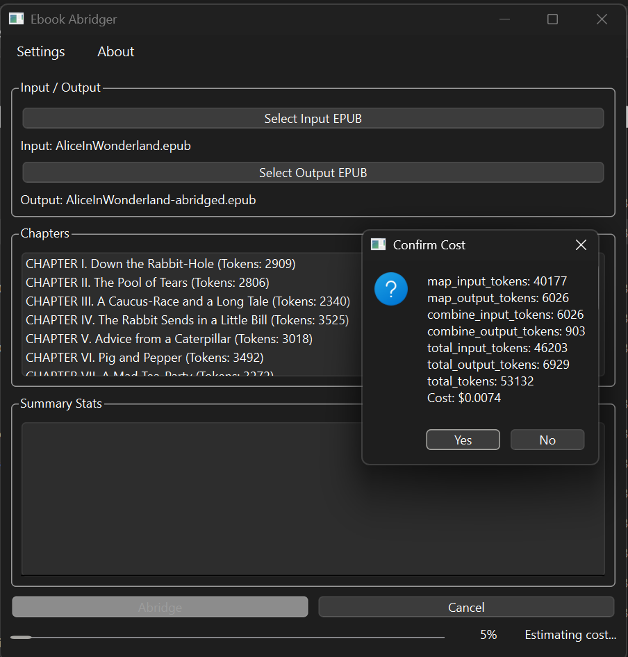
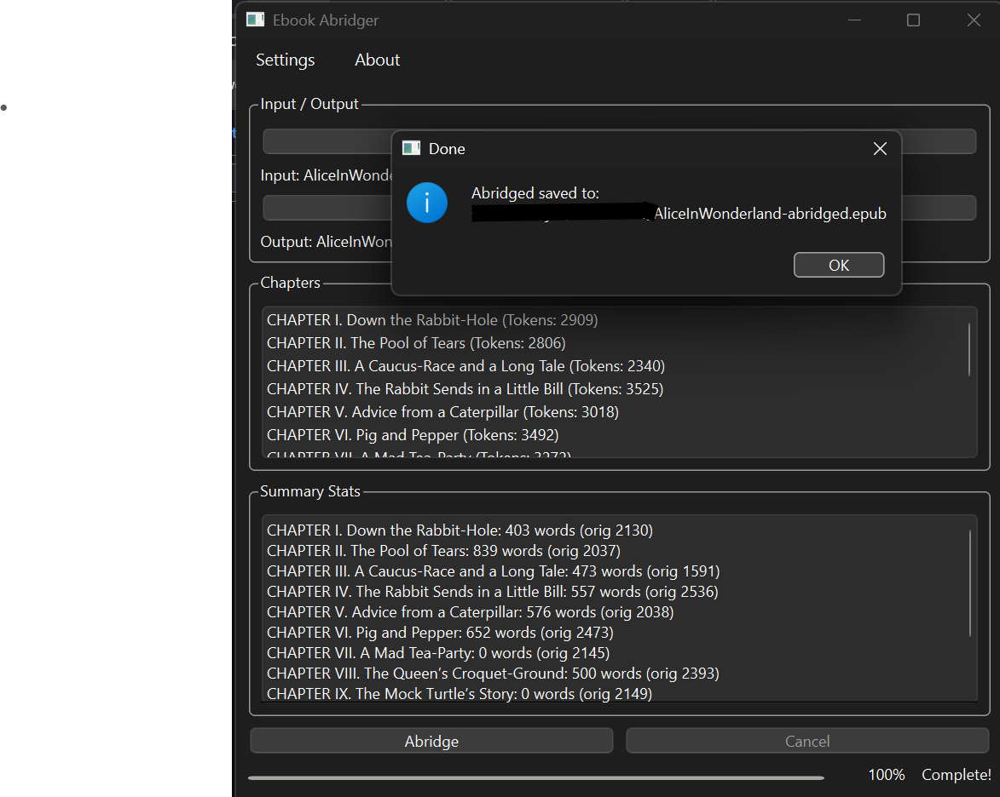
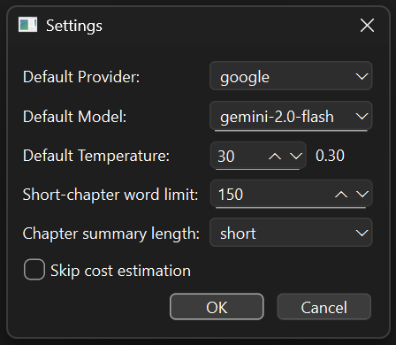

# Ebook Abridger

A Python application to generate abridged versions of EPUB ebooks using Large Language Models (LLMs). It preserves chapter structure, narrative flow, and key elements (dialogue, descriptions) while reducing length according to configurable settings.

Provides both a Command‑Line Interface (CLI) and a Graphical User Interface (GUI), plus options for cost estimation, summary-length tuning, and error/skipped‑chapter reporting.

---

## 🚀 Features

- **EPUB I/O**: Read standard EPUBs and write abridged EPUBs, preserving metadata (title, author, language).
- **AI‑Powered Summaries**: Chapter‑by‑chapter summarization via LangChain `map_reduce`, followed by an overall book summary.
- **Summary‑Length Control**: Choose among multiple length presets (e.g. `very_short`, `short`, `medium`, `long`) defined in `config.yaml`.
- **Genre Auto-detection**: Auto-detect genre(fiction vs non-fiction) and dynamically adjust prompts.
- **Skip Short Chapters**: Chapters under a configurable word‑count threshold bypass summarization and are passed through unaltered.
- **Error Handling**: Tracks and reports any chapters that failed to summarize due to API errors.
- **Cost Estimation**: Estimates token usage and cost (for API‑based LLMs), with optional confirmation prompt.
- **Dual Interface**:
  - **CLI** (`main.py`): Fully scriptable, supports `-y` to skip confirmation.
  - **GUI** (`gui.py`): PyQt6 app with Settings and About dialogs, progress bar, per‑chapter stats panel.
- **Configurable LLM Providers**:
  - **Google Gemini** (via API key)
  - **Ollama** (local models)
  - **OpenRouter** (via API key)

---

## 📁 Project Structure

```
ebook-abridger/
├── core/                     # Engine & utility modules
│   ├── __init__.py           # Marks this directory as a Python package
│   ├── config_loader.py      # YAML & .env loader helper
│   ├── cost_estimator.py     # Token & cost estimation logic
│   ├── epub_builder.py       # Rebuild EPUB with summaries
│   ├── epub_parser.py        # EPUB → Document parsing
│   ├── llm_config.py         # Loads .env & YAML, provides LLM factories
│   ├── prompts.py            # PromptTemplate factories for map/combine/overall
│   └── summarizer.py         # SummarizationEngine (chapters + overall)
├── gui.py                    # PyQt6 graphical interface entrypoint
├── main.py                   # CLI entrypoint
├── config.yaml               # Non-sensitive defaults & model/pricing configs
├── user_settings.json        # Persisted GUI overrides (created on first run)
├── .env.tempate              # Rename to .env and add your API keys
├── requirements.txt          # Python dependencies
└── build.spec                # PyInstaller spec for GUI/CLI
```

---

## ⚙️ Installation

```bash
git clone https://github.com/rejozacharia/ebook-abridger.git
cd ebook-abridger
python -m venv .venv
# Windows PowerShell:
.\.venv\Scripts\Activate.ps1
# macOS/Linux:
source .venv/bin/activate

pip install -r requirements.txt
```

If using Ollama for local models, [install Ollama](https://ollama.com/) and ensure it’s running.

---

## 🛠 Configuration

1. **Copy `.env`** from the template or create your own. Fill in:
   ```dotenv
   # API keys
   GOOGLE_API_KEY=...
   OPENROUTER_API_KEY=...
   OPENAI_API_BASE=https://openrouter.ai/api/v1
   OLLAMA_BASE_URL=http://localhost:11434

   ```

2. **Edit `config.yaml`** to adjust summary‑length percentages, add/change models (these appear in GUI) and their pricing :
   ```yaml
    chapter_summary_lengths:
      very_short: "15%"
      short: "25%"
      medium: "50%"
      long: "75%"
    default_chapter_summary_length: "short"

    models:
      google:
        default: "gemini-2.0-flash"
        available:
          - "gemma-3-27b-it"
          - "gemini-2.0-flash"
          - "gemini-1.5-flash"
          - "gemini-1.5-pro"
      openrouter:
        default: "mistralai/mistral-7b-instruct"
        available:
          - "mistralai/mistral-7b-instruct"
          - "google/gemini-flash-1.5"
          - "anthropic/claude-3-haiku"
      ollama:
        default: "llama3"
        available:
          - "llama3"
          - "mistral"
          - "phi3"

    pricing:
      gemini-2.0-flash:
        input_cost_per_million_tokens: 0.1
        output_cost_per_million_tokens: 0.4
      llama3:
        input_cost_per_million_tokens: 0.0
        output_cost_per_million_tokens: 0.0
   ```

---

## ▶️ Usage

### CLI
```bash
python main.py <input.epub> <output.epub> \
  -p <provider> [-m <model>] [-t <temperature>] \
  [-w <word_limit>] [-l <length_key>] [-y]
```
- `-w` / `--chapterwordlimit`: skip summarization below this word count.
- `-l` / `--summary-length`: one of the keys in `config.yaml`.
- `-y`: auto‑confirm cost estimate.

**Example**:
```bash
python main.py book.epub book_abridged.epub -p google -m gemini-1.5-pro -l medium -y
```

### GUI
```bash
python gui.py
```
Here’s the GUI of the app:



Completed view



- **Settings**: configure provider, model, temperature, word limit, summary length, skip estimation.

- **Abridge**: triggers parse → summary → build, shows per‑chapter stats in panel.

---

## 📦 Building Executables

Requires [PyInstaller](https://www.pyinstaller.org/):
```bash
pip install pyinstaller
pyinstaller build.spec        
```
Executables are output to `dist/`.

---

## 📝 License
Apache © Rejo Mathew

---

## 👀 Future Improvements

- Parallelize chapter summarization.
- LangChain caching for repeated runs.
- Enhanced cost heuristics per chain type.

