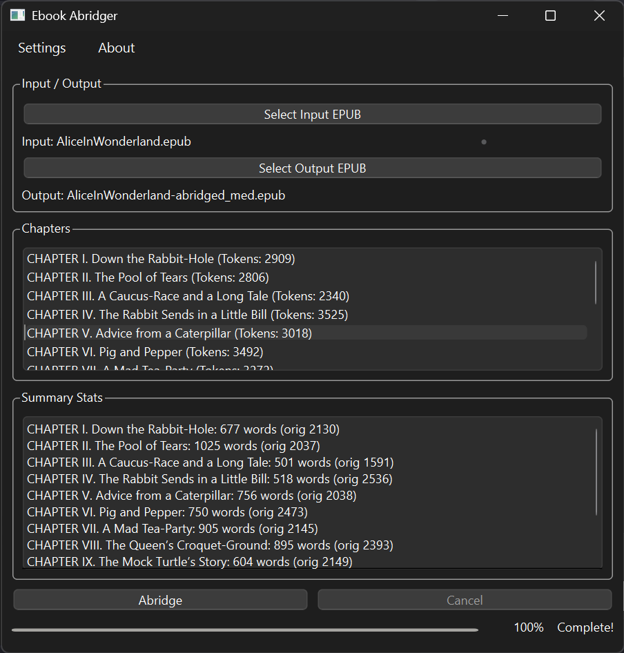

# Ebook Abridger

A Python application to generate abridged versions of EPUB ebooks using Large Language Models (LLMs). It preserves chapter structure, narrative flow, and key elements (dialogue, descriptions) while reducing length according to configurable settings.

Provides both a Command‑Line Interface (CLI) and a Graphical User Interface (GUI), plus options for cost estimation, summary-length tuning, and error/skipped‑chapter reporting.

---

## 🚀 Features

- **EPUB I/O**: Read standard EPUBs and write abridged EPUBs, preserving metadata (title, author, language).
- **AI‑Powered Summaries**: Chapter‑by‑chapter summarization via LangChain `map_reduce`, followed by an overall book summary.
- **Summary‑Length Control**: Choose among multiple length presets (e.g. `very_short`, `short`, `medium`, `long`) defined in `config.yaml`.
- **Genre Auto-detection**: Auto-detect genre(fiction vs non-fiction) and dynamically adjust prompts.
- **Skip Short Chapters**: Chapters under a configurable word‑count threshold bypass summarization and are passed through unaltered.
- **Error Handling**: Tracks and reports any chapters that failed to summarize due to API errors.
- **Cost Estimation**: Estimates token usage and cost (for API‑based LLMs), with optional confirmation prompt.
- **Dual Interface**:
  - **CLI** (`main.py`): Fully scriptable, supports `-y` to skip confirmation.
  - **GUI** (`gui.py`): PyQt6 app with Settings and About dialogs, progress bar, per‑chapter stats panel.
- **Configurable LLM Providers**:
  - **Google Gemini** (via API key)
  - **Ollama** (local models)
  - **OpenRouter** (via API key)

---

## 📁 Project Structure

```
ebook-abridger/
├── core/                     # Engine & utility modules
│   ├── __init__.py           # Marks this directory as a Python package
│   ├── config_loader.py      # YAML & .env loader helper
│   ├── cost_estimator.py     # Token & cost estimation logic
│   ├── epub_builder.py       # Rebuild EPUB with summaries
│   ├── epub_parser.py        # EPUB → Document parsing
│   ├── llm_config.py         # Loads .env & YAML, provides LLM factories
│   ├── prompts.py            # PromptTemplate factories for map/combine/overall
│   └── summarizer.py         # SummarizationEngine (chapters + overall)
├── gui.py                    # PyQt6 graphical interface entrypoint
├── main.py                   # CLI entrypoint
├── config.yaml               # Non-sensitive defaults & model/pricing configs
├── user_settings.json        # Persisted GUI overrides (created on first run)
├── .env.template             # Rename to .env and add your API keys
├── requirements.txt          # Python dependencies
└── build.spec                # PyInstaller spec for GUI/CLI
```

---

## ⚙️ Installation

### Option 1: Using Pre-built Executables (Recommended)

1.  **Download:** Go to the [Releases page](https://github.com/rejozacharia/ebook-abridger/releases) and download the `ebook-abridger.zip` file from the latest release.
2.  **Extract:** Unzip the downloaded file to a location of your choice. This will create an `ebook-abridger` folder containing the application executables (`ebook_abridger_gui.exe`, `ebook_abridger_cli.exe`), configuration files (`config.yaml`, `.env.template`), and necessary resources.

### Option 2: From Source (For Development)

1.  **Clone:**
    ```bash
    git clone https://github.com/rejozacharia/ebook-abridger.git
    cd ebook-abridger
    ```
2.  **Set up Environment:**
    ```bash
    python -m venv .venv
    # Windows PowerShell:
    .\.venv\Scripts\Activate.ps1
    # macOS/Linux:
    source .venv/bin/activate
    ```
3.  **Install Dependencies:**
    ```bash
    pip install -r requirements.txt
    ```

### Additional Setup (Both Options)

-   If using **Ollama** for local models, [install Ollama](https://ollama.com/) and ensure it’s running.
-   If using **Google Gemini** or **OpenRouter**, you will need API keys (see Configuration).

---

## 🛠 Configuration

Configuration is done via two files located in the main application directory (either the extracted zip folder or the cloned repository):

1.  **`.env` File:**
    -   Rename `.env.template` to `.env`.
    -   Edit `.env` and add your API keys if you plan to use Google Gemini or OpenRouter. You can leave keys blank if you only use Ollama.
    ```dotenv
    # API keys (only fill in what you need)
    GOOGLE_API_KEY=YOUR_GOOGLE_API_KEY
    OPENROUTER_API_KEY=YOUR_OPENROUTER_API_KEY

    # Base URLs (usually leave as default)
    OPENAI_API_BASE=https://openrouter.ai/api/v1
    OLLAMA_BASE_URL=http://localhost:11434
    ```

2.  **`config.yaml` File:**
    -   This file controls model selection, summary length presets, pricing information (for cost estimation), and other defaults.
    -   You can edit this file to:
        -   Adjust the percentage reduction for summary lengths (`very_short`, `short`, etc.).
        -   Change the default models for each provider (`google`, `openrouter`, `ollama`).
        -   Add or remove available models listed under each provider (these appear in the GUI dropdown).
        -   Update pricing data if needed (used for cost estimates).
    ```yaml
    # Example snippet from config.yaml
    chapter_summary_lengths:
      very_short: "15%"
      short: "25%"
      medium: "50%"
      long: "75%"
    default_chapter_summary_length: "short"

    models:
      google:
        default: "gemini-2.0-flash"
        available:
          - "gemma-3-27b-it"
          - "gemini-2.0-flash"
          # ... other models
      # ... other providers

    pricing:
      gemini-2.0-flash:
        input_cost_per_million_tokens: 0.1
        output_cost_per_million_tokens: 0.4
      # ... other models
    ```

---

## ▶️ Usage

After installation and configuration:

### Using Executables (Downloaded from Releases)

Navigate to the directory where you extracted `ebook-abridger.zip`.

**GUI:**

Double-click `ebook_abridger_gui.exe` or run it from your terminal within that directory:
```bash
# Windows Command Prompt or PowerShell:
.\ebook_abridger_gui.exe
# macOS/Linux (if built for those platforms):
./ebook_abridger_gui
```
The GUI allows you to select input/output files and configure settings visually.

**CLI:**

Run the CLI executable from your terminal within the extracted directory:
```bash
# Windows Command Prompt or PowerShell:
.\ebook_abridger_cli.exe <input.epub> <output.epub> [options]
# macOS/Linux (if built for those platforms):
./ebook_abridger_cli <input.epub> <output.epub> [options]
```
**Common Options:**
```
  -p <provider>       LLM provider ('google', 'openrouter', 'ollama')
  -m <model>          Specific model name (must be in config.yaml)
  -t <temperature>    LLM temperature (e.g., 0.7)
  -w <word_limit>     Skip chapters below this word count
  -l <length_key>     Summary length ('very_short', 'short', etc. from config.yaml)
  -y                  Auto-confirm cost estimate (skip prompt)
```

**Example (Windows):**
```bash
.\ebook_abridger_cli.exe my_book.epub my_book_abridged.epub -p ollama -m llama3 -l short -w 500
```

---

### Using Python Scripts (If installed from source)

Ensure your virtual environment is activated (`.\.venv\Scripts\Activate.ps1` or `source .venv/bin/activate`). Run the scripts from the cloned repository root.

**CLI:**
```bash
python main.py <input.epub> <output.epub> [options]
```
*(Options are the same as the CLI executable)*

**Example:**
```bash
python main.py book.epub book_abridged.epub -p google -m gemini-1.5-pro -l medium -y
```

**GUI:**
```bash
python gui.py
```
*(GUI operation is the same as the executable version)*

---

*(Screenshots remain the same)*


Completed view

- **Settings**: configure provider, model, temperature, word limit, summary length, skip estimation.


---

## 📦 Building Executables (Optional)

Pre-built executables are available on the [Releases page](https://github.com/rejozacharia/ebook-abridger/releases). This section is only necessary if you want to build the executables yourself from the source code.

Requires [PyInstaller](https://www.pyinstaller.org/):
```bash
# Ensure you are in the activated virtual environment
pip install pyinstaller
# Run from the project root directory
pyinstaller build.spec
```
Executables (`ebook_abridger_gui.exe`, `ebook_abridger_cli.exe`) and supporting files will be output to the `dist/ebook_abridger` directory.
---

## 📝 License
Apache 2.0 
---

## 👀 Future Improvements

- Parallelize chapter summarization.
- LangChain caching for repeated runs.
- Enhanced cost heuristics per chain type.

